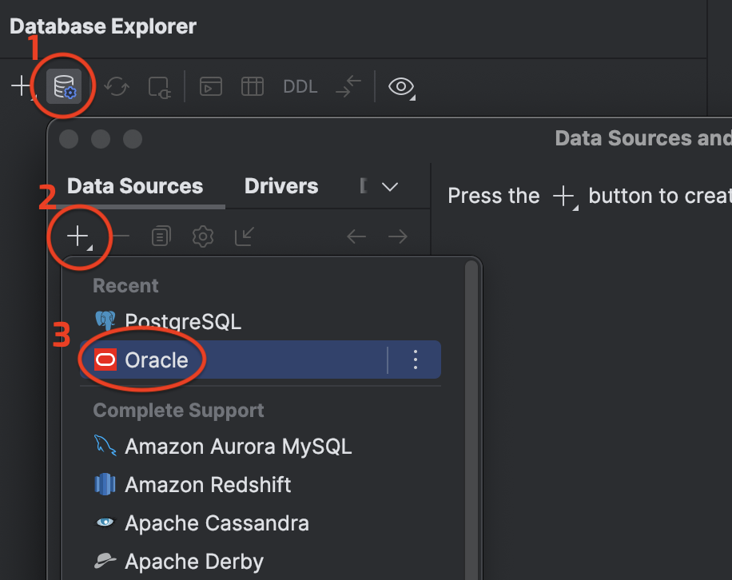

# X86-64 Architecture

This method uses a databse with x86 architecture, which might be slower to run, but it super easy to set up and run.

## Instalation:
### Prev configuration:
To be able to intall an oracle SQL server on a Mac M1, one of the easiest ways is to install it using docker, that's what we will be using in this tutorial.

So, the first step is to install docker: [Docker Download](https://www.docker.com/get-started/).

After that, we have to check that Homebrew is installed. 
```sh
which brew
```

If it is not, then install it -> [Homebrew](https://brew.sh/).


Then we have to install [colima](https://github.com/abiosoft/colima)
```sh
brew install colima
```
This is a combination of *CO*ntainers (from docker) and [LIMA](https://github.com/lima-vm/lima)


### Container + conlima boot-up:
After the all the required programs are installed, we have to create for the first time the colima instance:
```sh
colima start --arch x86_64 --memory 4
```
We are specifiyng the architecture we want, as that is the objectivo of using colima, to be able to execute containters with an architecture differente from aarch64 (the one of the M series processors). We are also limiting the memory usage to 4 GB

After the first time creating it, we can just use
```sh
colima start
```
to start it.

After the start up, which may take some time, we have to create the docker container. Check you have docker installed and then run:
```sh
docker run -d \
-p 1521:1521 \
-e ORACLE_PASSWORD=<password> \ 
-v oracle-volume:/opt/oracle/oradata \
gvenzl/oracle-xe
```
This command start a container with the following configurations:

| Parameter                            | Meaning                                                                                             |
| ------------------------------------ | --------------------------------------------------------------------------------------------------- |
| -d                                   | Run in detached mode                                                                                |
| -p 1521:1521                         | "Link" the port 1521 from the container to the port of the localhost 1521                           |
| -e ORACLE_PASSWORD=<password>        | Set the environment variable <password> for the default password.                              |
| -v oracle-volume:/opt/oracle/oradata | Creates a volume named oracle-volume and mounts it to the path /opt/oracle/oradata in the container |
| gvenzl/oracle-xe                     | Name of the base image                                                                              |

Username & Password[^1] 

After this, if the image is not already in you container, which if it is the first time, it wont be, it will download it and uncompress it. 

Then, after the container has started, we will get the *CONTAINER ID* from the command:
```sh
docker container ls -a
```
With this identifier, we can start to operate with the container and check its status.


### Conect to the DB with SQLPLUS
#### From the container itself:
To start up a bash "session" in the continer we have to run the command:
```sh
docker exec -it <containerID> bash
```

Just run 
```sh 
sqlplus system/your_secure_pwd@//localhost/XEPDB1
```

#### From another software such as [DataGrip](https://www.jetbrains.com/datagrip/)
Create a new conection to a database:


Than fill the data with the username: ```system```and the password you specified when creating the container.


[^1]: The default user is system and the password the one you entered above.


